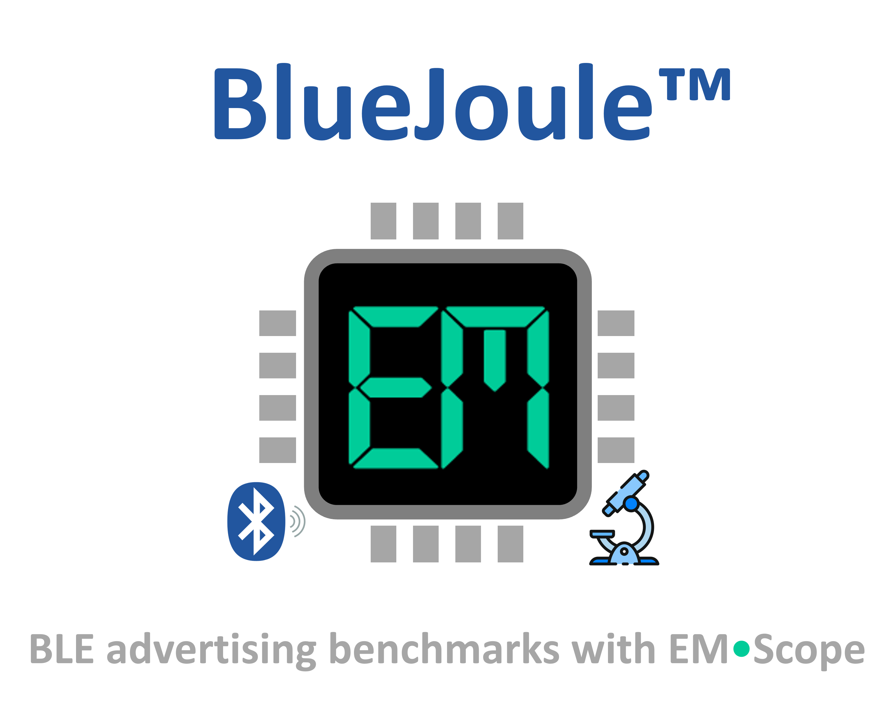

<p align="center">
    
</p>
<br>
<p align="center">
    &emsp;&ensp;
</p>

<br>
<br>
<br>

<p align="right">
  <sup><a href="README.md">for a better view <b>&#x27a6;</b></a></sup>
</p>

<p align="center"></p>


---

<a id="toc"></a>

<h3 align="center">
  <a href="#application">Application</a>&nbsp;&#xFF5C;&nbsp;
  <a href="#catalog">Catalog</a>&nbsp;&#xFF5C;&nbsp;
  <a href="#scores">Scores</a>&nbsp;&#xFF5C;&nbsp;
  <a href="#contributing">Contributing</a>
</h3>

<br>

This repository uses **EM&bull;Scope** to benchmark a representative **Bluetooth Low Energy** [BLE] application executing on a wide-range of HW/SW platforms.&thinsp; Visit the [em-foundation/emscope](https://github.com/em-foundation/emscope) project to learn more about the **EM&bull;Scope** tool itself.

## Application

Repetitve advertising remains a fundamental modality of any Bluetooth Low Energy application.&thinsp; Because of its inherent simplicity, programs illustrating the [BLE broadcaster role](https://novelbits.io/bluetooth-low-energy-advertisements-part-1/) often serve as the "Hello World" within this space.

Our benchmark will broadcast the same packet on the three standard BLE advertising channels.&thinsp; These transmissions occur back-to-back within a single _advertising event_; and these events will unfold at a 1&thinsp;s _advertising interval_. 

To faciliate "apples-to-apples" comparisons among different platforms, we require the underlying BLE radio to transmit packets at 0&thinsp;dB.&thinsp; A differentiator for HW vendors, TX power consumption in `mW` will often headline their datasheets.

And finally, the BLE advertising packet itself with 17 bytes of payload comprising the following standard data types:

| Len | Type | Data (hex)                                   | Notes                                         |
|----:|-----:|----------------------------------------------|-----------------------------------------------|
| `02`  |  `01`  | `06`                                     | Flags &mdash; LE General Disc + BR/EDR not supported      |
| `0A`  |  `08`  | `42 6C 75 65 4A 6F 75 6C 65`             | Local Name &mdash; `"BlueJoule"`             |
| `05`  |  `FF`  | `D3 08 FF`                               | Manufacturer &mdash; Company:&thinsp; [Novel Bits](https://novelbits.io/) (`0x08D3`),&thinsp; Data: `0xFF`&emsp; |

When _not_ actively advertising &ndash; over 99% of the time, in fact, within a 1&thinsp;Hz event cycle &ndash; we presume that the application has entered some "deep-sleep" mode to minimize power consumption.

## Catalog

This repository houses the following curated **EM&bull;Scope** capture directories &ndash; each initially populated by the `emscope grab` command with either its `-J, --js220` or `-P, --ppk2` option:

| JS220 Capture | PPK2 Capture | &emsp;&emsp;&emsp;&emsp;&emsp;&emsp;&emsp;&emsp;&emsp;&emsp;&emsp;Description&emsp;&emsp;&emsp;&emsp;&emsp;&emsp;&emsp;&emsp;&emsp;&emsp;&emsp;&emsp;&emsp; |
|---|---|---|
| [`adi-m17-evk-msdk-J`](data/adi-m17-evk-msdk-J/) | [`adi-m17-evk-msdk-P`](data/adi-m17-evk-msdk-P/) | &emsp; Analog Device MAX32655 · Maxim SDK|
| [`in-100-dk-none-J`](data/in-100-dk-none-J/) | [`in-100-dk-none-P`](data/in-100-dk-none-P/) | &emsp; InPlay IN100 · &lt;no software&gt; |
| [`nrf-52-dk-zephyr-J`](data/nrf-52-dk-zephyr-J/) | [`nrf-52-dk-zephyr-P`](data/nrf-52-dk-zephyr-P/) | &emsp; Nordic nRF52832 · Zephyr OS |
| [`nrf-54-dk-zephyr-J`](data/nrf-54-dk-zephyr-J/) | [`nrf-54-dk-zephyr-P`](data/nrf-54-dk-zephyr-P/) | &emsp; Nordic nRF54L15 · Zephyr OS |
| [`ti-23-lp-emsdk-J`](data/ti-23-lp-emsdk-J) | &nbsp; | &emsp; Texas Instruments CC2340R5 · EM&bull;Script SDK |
| [`ti-23-lp-slsdk-J`](data/ti-23-lp-slsdk-J/ABOUT.md) | [`ti-23-lp-slsdk-P`](data/ti-23-lp-slsdk-P/) | &emsp; Texas Instruments CC2340R5 · SimpleLink SDK |

An `ABOUT.md` file found in each directory provides additional information about the capture's HW/SW configuration.

## Scores

We've compiled a pair of **EM&bull;erald** scores for each capture, assuming a 1&thinsp;s and 10&thinsp;s event cycle in each case.&thinsp; We've also awarded Gold&thinsp;🥇, Silver&thinsp;🥈, and Bronze&thinsp;🥉 medals when merited.

> [!IMPORTANT]
> Because of their different signal acquisition and power analysis capabilities, we've presented the **Joulescope JS220** and **Nordic PPK2** scores separately.&thinsp; While results generally seem consistent, anomalies can sometimes occur.

<br>

> [!TIP]
> To query the following **JS220** scores, run these commands from the root of this repository:
> ```
> emscope view -w 1 --score -C '*-J'
> emscope view -w 10 --score -C '*-J'
> ```

| JS220 Capture&emsp;&emsp;&emsp;&emsp;&emsp;&emsp;&emsp;&emsp; | EM&thinsp;🟢&thinsp;eralds&thinsp; @&thinsp;`00:00:01`| EM&thinsp;🟢&thinsp;eralds&thinsp; @&thinsp;`00:00:10` |
|---|---|---|
| [`adi-m17-evk-msdk-J`](data/adi-m17-evk-msdk-J/) | ` 14.75` | ` 47.75` |
| [`in-100-dk-none-J`](data/in-100-dk-none-J/) | ` 41.92` &emsp; 🥈 | `306.84` &emsp; 🥇 |
| [`nrf-52-dk-zephyr-J`](data/nrf-52-dk-zephyr-J/) | ` 27.72` | `122.85` |
| [`nrf-54-dk-zephyr-J`](data/nrf-54-dk-zephyr-J/) | ` 41.93` &emsp; 🥈 | `121.06` |
| [`ti-23-lp-emsdk-J`](data/ti-23-lp-emsdk-J/) | ` 48.62`  &emsp; 🥇 | `249.88` &emsp; 🥈 |
| [`ti-23-lp-slsdk-J`](data/ti-23-lp-slsdk-J/) | ` 28.13`| `183.76` &emsp; 🥉 |

<br>

> [!TIP]
> To query the following **PPK2** scores, run these commands from the root of this repository:
> ```
> emscope view -w 1 --score -C '*-P'
> emscope view -w 10 --score -C '*-P'
> ```

| PPK2 Capture&emsp;&emsp;&emsp;&emsp;&emsp;&emsp;&emsp;&emsp; | EM&thinsp;🟢&thinsp;eralds&thinsp; @&thinsp;`00:00:01`| EM&thinsp;🟢&thinsp;eralds&thinsp; @&thinsp;`00:00:10` |
|---|---|---|
| [`adi-m17-evk-msdk-P`](data/adi-m17-evk-msdk-P/) | ` 14.02` | ` 47.36` |
| [`in-100-dk-none-P`](data/in-100-dk-none-P/) | ` 43.11` &emsp; 🥈 | `301.01` &emsp; 🥇 |
| [`nrf-52-dk-zephyr-P`](data/nrf-52-dk-zephyr-P/) | ` 27.30` | `113.68` |
| [`nrf-54-dk-zephyr-P`](data/nrf-54-dk-zephyr-P/) | ` 57.21` &emsp; 🥇 | `153.61` &emsp; 🥉 |
| [`ti-23-lp-slsdk-P`](data/ti-23-lp-slsdk-P/) | ` 27.37`| `173.87` &emsp; 🥈 |


## Contributing

To contribute new captures (or to refine existing captures), fork this repository and then submit a pull request (PR) for our consideration.&thinsp; Needless to say, we presume prior experience with the [`emscope`](&thinsp;🟢&thinsp;) command-line tool.

> [!TIP]
> Use this command sequence when locally cloning your fork of this repo:
>
>```
> $ GIT_LFS_SKIP_SMUDGE=1 git clone --filter=blob:none https://github.com/<USER-NAME>/<FORKED-REPO-NAME>
> $ cd <FORKED-REPO-NAME>
> $ git lfs install --local --skip-smudge
>```
>From here, you can use `emscope pack -u` to deflate `emscope-capture.zip` files locally as needed.

If you plan to submit a new capture, create a directory whose name follows the labeling conventions used throughout this repo.&thinsp; Copy an existing capture's `ABOUT.md` file into your new directory, and then modify this file's contents accordingly.

For any technical questions or roadmap suggestions, start a thread on our [discussions](https://github.com/em-foundation/bleadv-data/discussions/) page.


