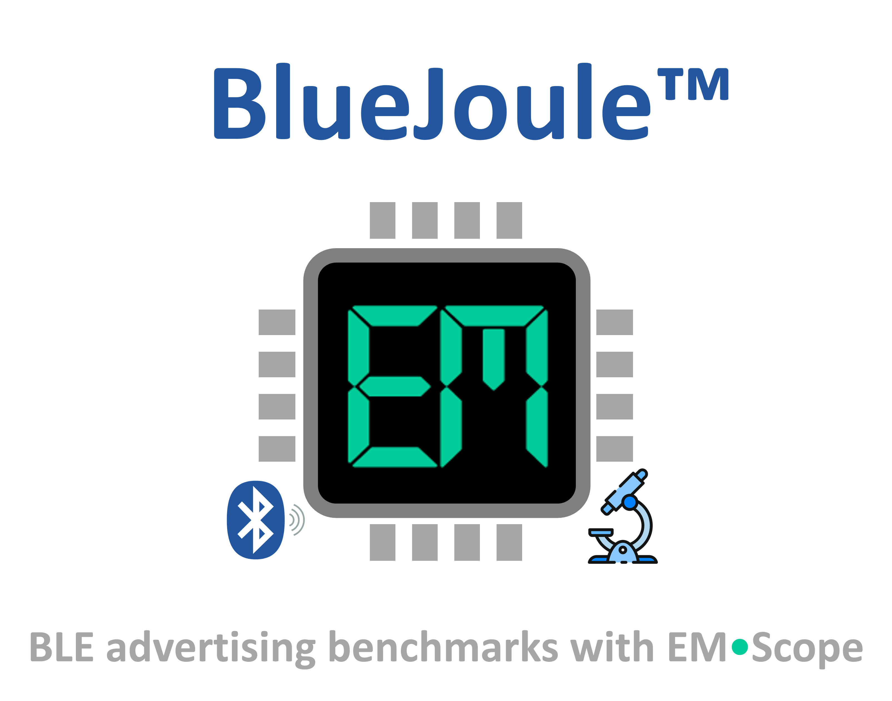

    

---

This repository uses **EM&bull;Scope** to benchmark **BlueJoule** &ndash; a representative **Bluetooth Low Energy** [BLE] appli&shy;cation executing on a wide-range of HW/SW platforms.&thinsp; Visit the [em-foundation/emscope](https://github.com/em-foundation/emscope) project to learn more about the **EM&bull;Scope** tool itself.

Cloning (or downloading) this repository gives you access to raw signal captures as well as executable program images used in generating the current set of **BlueJoule** scores for a range of BLE HW/SW platforms.

> [!IMPORTANT]
> This repository contains GitHub LFS [Large File Storage] objects, hence cloning this repo in the usual way will consume much time and space on your end.&thinsp; Follow the link below for more information about working with and contributing to this project.

  <a href="docs/ReadMore.md">read more<b>&nbsp;&#x27a6;</b></a>

