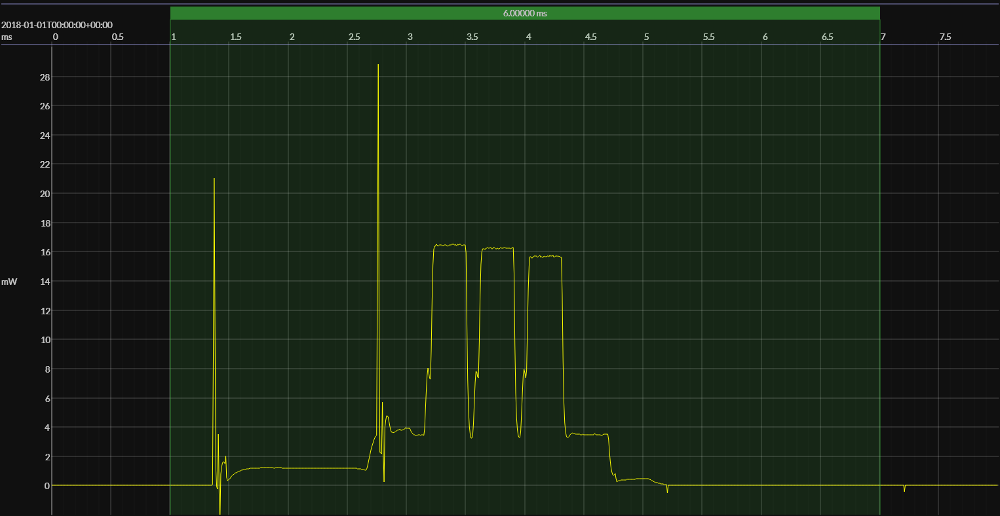

<h1 align="center">InPlay IN100 · &lt;no software&gt;</h1>

## HW/SW configuration

## EM&bull;Scope results

<!-- @emscope-pack:start -->

### 🟠&ensp;sleep

| supply voltage | &emsp;current (avg)&emsp; | &emsp;current (std)&emsp; | &emsp;average power&emsp;
|:---:|:---:|:---:|:---:|
| 1.82 V | 494.832 nA | 113.607 nA | 898.787 nW |

### 🟠&ensp;1&thinsp;s event cycle

| &emsp;&emsp;event energy (avg)&emsp;&emsp; | &emsp;&emsp;energy per cycle&emsp;&emsp; | &emsp;&emsp;energy per day&emsp;&emsp; | &emsp;&emsp;&emsp;**EM&bull;eralds**&emsp;&emsp;&emsp;
|:---:|:---:|:---:|:---:|
|  21.189 µJ |  22.087 µJ |   1.908 J | 41.92 |

### 🟠&ensp;10&thinsp;s event cycle

| &emsp;&emsp;event energy (avg)&emsp;&emsp; | &emsp;&emsp;energy per cycle&emsp;&emsp; | &emsp;&emsp;energy per day&emsp;&emsp; | &emsp;&emsp;&emsp;**EM&bull;eralds**&emsp;&emsp;&emsp;
|:---:|:---:|:---:|:---:|
|  21.189 µJ |  30.177 µJ | 260.725 mJ | 306.84 |

 

generated at 2025-08-31T15:39:38.942Z

    

<!-- @emscope-pack:end -->

## Typical event

    

## Observations

