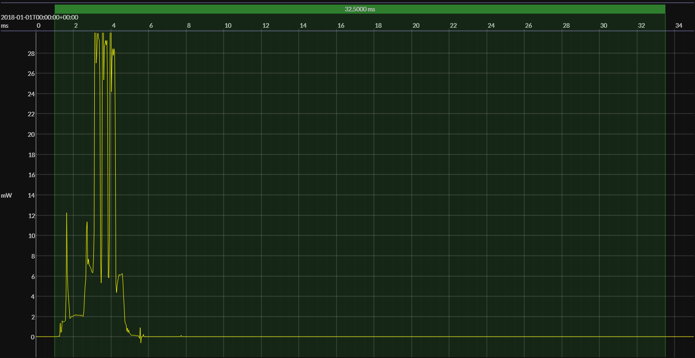

<h1 align="center">InPlay IN100 · &lt;no software&gt;</h1>

## HW/SW configuration

## EM&bull;Scope results

<!-- @emscope-pack:start -->

### 🟠&ensp;sleep

| supply voltage | &emsp;current (avg)&emsp; | &emsp;current (std)&emsp; | &emsp;average power&emsp;
|:---:|:---:|:---:|:---:|
| 3.28 V | 649.143 nA | 130.168 nA |   2.129 µW |

### 🟠&ensp;1&thinsp;s event period

| &emsp;&emsp;event energy (avg)&emsp;&emsp; | &emsp;&emsp;energy per period&emsp;&emsp; | &emsp;&emsp;energy per day&emsp;&emsp; | &emsp;&emsp;&emsp;**EM&bull;eralds**&emsp;&emsp;&emsp;
|:---:|:---:|:---:|:---:|
|  38.390 µJ |  40.520 µJ |   3.501 J | 22.85 |

### 🟠&ensp;10&thinsp;s event period

| &emsp;&emsp;event energy (avg)&emsp;&emsp; | &emsp;&emsp;energy per period&emsp;&emsp; | &emsp;&emsp;energy per day&emsp;&emsp; | &emsp;&emsp;&emsp;**EM&bull;eralds**&emsp;&emsp;&emsp;
|:---:|:---:|:---:|:---:|
|  38.390 µJ |  59.682 µJ | 515.651 mJ | 155.14 |

 

generated at 2025-09-07T21:00:17.392Z

    

<!-- @emscope-pack:end -->

## Typical event

    

## Observations

