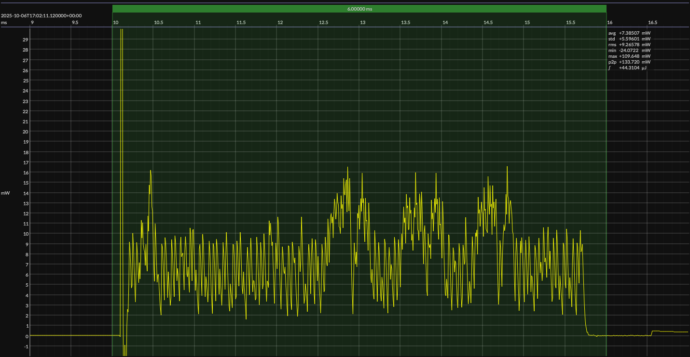

<h1 align="center">Analog Devices MAX32655 · Maxim SDK · 3V3</h1>

## HW/SW configuration

## EM&bull;Scope results

<!-- @emscope-pack:start -->

captured on 2025-08-17 @ 01:38:00 generated on 2025-11-08 @ 17:06:58

## HW/SW Configuration

## EM&bull;Scope results · JS220

### 🟠&ensp;sleep

| supply voltage | &emsp;current (avg)&emsp; | &emsp;current (std)&emsp; | &emsp;average power&emsp;
|:---:|:---:|:---:|:---:|
| 3.3 V |  4.4 µA |  0.9 µA | 14.6 µW |

### 🟠&ensp;1&thinsp;s event period

| &emsp;&emsp;event energy (avg)&emsp;&emsp; | &emsp;&emsp;energy per period&emsp;&emsp; | &emsp;&emsp;energy per day&emsp;&emsp; | &emsp;&emsp;&emsp;**EM&bull;eralds**&emsp;&emsp;&emsp;
|:---:|:---:|:---:|:---:|
| 48.2 µJ | 62.8 µJ |  5.4 J | 14.75 |

### 🟠&ensp;10&thinsp;s event period

| &emsp;&emsp;event energy (avg)&emsp;&emsp; | &emsp;&emsp;energy per period&emsp;&emsp; | &emsp;&emsp;energy per day&emsp;&emsp; | &emsp;&emsp;&emsp;**EM&bull;eralds**&emsp;&emsp;&emsp;
|:---:|:---:|:---:|:---:|
| 48.2 µJ | 193.9 µJ |  1.7 J | 47.75 |

## Typical Event

## Notes

<!-- @emscope-pack:end -->

## Typical event

    

## Observations

