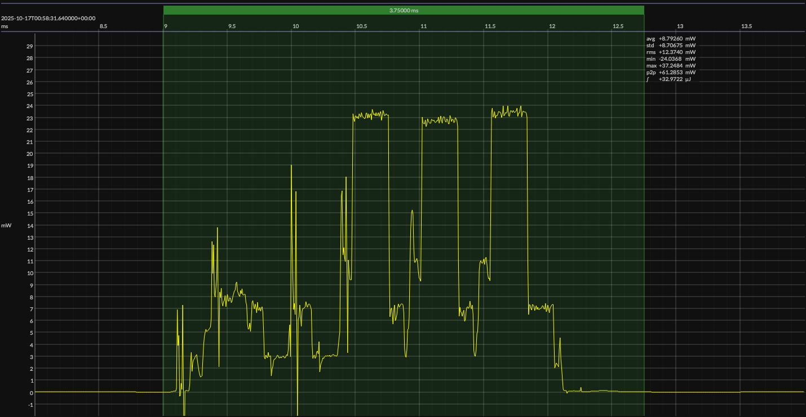

<h1 align="center">EM Microelectronic · EM Bleu</h1>

## HW/SW configuration

## EM&bull;Scope results

<!-- @emscope-pack:start -->

### 🟠&ensp;sleep

| supply voltage | &emsp;current (avg)&emsp; | &emsp;current (std)&emsp; | &emsp;average power&emsp;
|:---:|:---:|:---:|:---:|
| 3.28 V | 892.369 nA | 480.977 nA |   2.931 µW |

### 🟠&ensp;1&thinsp;s event period

| &emsp;&emsp;event energy (avg)&emsp;&emsp; | &emsp;&emsp;energy per period&emsp;&emsp; | &emsp;&emsp;energy per day&emsp;&emsp; | &emsp;&emsp;&emsp;**EM&bull;eralds**&emsp;&emsp;&emsp;
|:---:|:---:|:---:|:---:|
|  33.087 µJ |  36.018 µJ |   3.112 J | 25.71 |

### 🟠&ensp;10&thinsp;s event period

| &emsp;&emsp;event energy (avg)&emsp;&emsp; | &emsp;&emsp;energy per period&emsp;&emsp; | &emsp;&emsp;energy per day&emsp;&emsp; | &emsp;&emsp;&emsp;**EM&bull;eralds**&emsp;&emsp;&emsp;
|:---:|:---:|:---:|:---:|
|  33.087 µJ |  62.400 µJ | 539.135 mJ | 148.39 |

 

generated at 2025-10-17T01:02:36.416Z

    

<!-- @emscope-pack:end -->

## Typical event

    

## Observations

