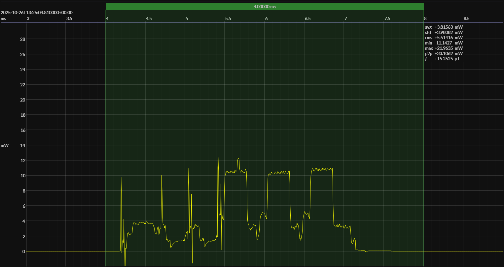

<h1 align="center">EM Microelectronic EM9305 · EM Bleu SDK · 1V5</h1>

## HW/SW configuration

## EM&bull;Scope results

<!-- @emscope-pack:start -->

### 🟠&ensp;sleep

| supply voltage | &emsp;current (avg)&emsp; | &emsp;current (std)&emsp; | &emsp;average power&emsp;
|:---:|:---:|:---:|:---:|
| 1.49 V | 692.161 nA | 739.713 nA |   1.033 µW |

### 🟠&ensp;1&thinsp;s event period

| &emsp;&emsp;event energy (avg)&emsp;&emsp; | &emsp;&emsp;energy per period&emsp;&emsp; | &emsp;&emsp;energy per day&emsp;&emsp; | &emsp;&emsp;&emsp;**EM&bull;eralds**&emsp;&emsp;&emsp;
|:---:|:---:|:---:|:---:|
|  15.261 µJ |  16.295 µJ |   1.408 J | 56.82 |

### 🟠&ensp;10&thinsp;s event period

| &emsp;&emsp;event energy (avg)&emsp;&emsp; | &emsp;&emsp;energy per period&emsp;&emsp; | &emsp;&emsp;energy per day&emsp;&emsp; | &emsp;&emsp;&emsp;**EM&bull;eralds**&emsp;&emsp;&emsp;
|:---:|:---:|:---:|:---:|
|  15.261 µJ |  25.595 µJ | 221.143 mJ | 361.76 |

 

generated at 2025-10-26T13:27:12.127Z

    

<!-- @emscope-pack:end -->

## Typical event

    

## Observations

