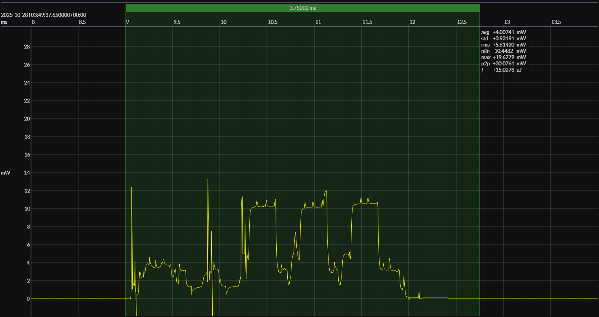

<h1 align="center">EM Microelectronic EM9305 · EM Bleu SDK · 1V5</h1>

## HW/SW configuration

## EM&bull;Scope results

<!-- @emscope-pack:start -->

captured on 2025-10-28 @ 03:40:39 generated on 2025-11-08 @ 17:06:59

## HW/SW Configuration

* [EMDVK9305SOC](https://www.emmicroelectronic.com/sites/default/files/products/datasheets/EM9305%20SOC%20DVK%20FACTSHEET.pdf) &thinsp;&ratio;&thinsp; **EM Microelectronic EM9305 SOC DVK**
* [EM9305 SoC](https://www.emmicroelectronic.com/product/standard-protocols/em-bleu-em9305) &thinsp;&ratio;&thinsp; 48 MHz ARC EM7D &thinsp;·&thinsp; 512 KB flash &thinsp;·&thinsp; 64 KB SRA
* [BOARD PINOUT](https://github.com/em-foundation/emscope/blob/docs-stable/docs/boards/emm-9305-dvk.png) &thinsp;⚙️

## EM&bull;Scope results · JS220

### 🟠&ensp;sleep

| supply voltage | &emsp;current (avg)&emsp; | &emsp;current (std)&emsp; | &emsp;average power&emsp;
|:---:|:---:|:---:|:---:|
| 1.5 V |  0.5 µA |  0.7 µA | 761.6 nW |

### 🟠&ensp;1&thinsp;s event period

| &emsp;&emsp;event energy (avg)&emsp;&emsp; | &emsp;&emsp;energy per period&emsp;&emsp; | &emsp;&emsp;energy per day&emsp;&emsp; | &emsp;&emsp;&emsp;**EM&bull;eralds**&emsp;&emsp;&emsp;
|:---:|:---:|:---:|:---:|
| 15.1 µJ | 15.8 µJ |  1.4 J | 58.54 |

### 🟠&ensp;10&thinsp;s event period

| &emsp;&emsp;event energy (avg)&emsp;&emsp; | &emsp;&emsp;energy per period&emsp;&emsp; | &emsp;&emsp;energy per day&emsp;&emsp; | &emsp;&emsp;&emsp;**EM&bull;eralds**&emsp;&emsp;&emsp;
|:---:|:---:|:---:|:---:|
| 15.1 µJ | 22.7 µJ |  0.2 J | 408.41 |

## Typical Event

## Notes

<!-- @emscope-pack:end -->

## Typical event

    

## Observations

