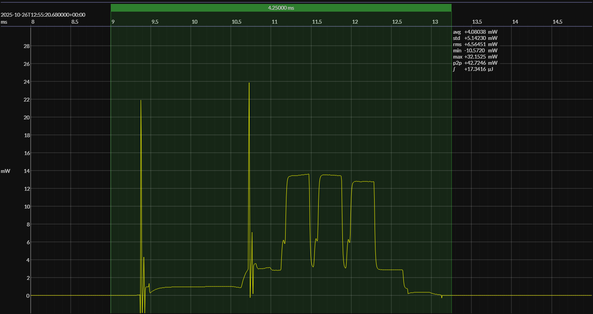

<h1 align="center">InPlay IN100 · &lt;no code&gt; · 1V5</h1>

## HW/SW configuration

## EM&bull;Scope results

<!-- @emscope-pack:start -->

captured on 2025-10-26 @ 12:53:33 generated on 2025-11-08 @ 17:07:00

## HW/SW Configuration

## EM&bull;Scope results · JS220

### 🟠&ensp;sleep

| supply voltage | &emsp;current (avg)&emsp; | &emsp;current (std)&emsp; | &emsp;average power&emsp;
|:---:|:---:|:---:|:---:|
| 1.5 V |  0.4 µA |  0.8 µA | 664.8 nW |

### 🟠&ensp;1&thinsp;s event period

| &emsp;&emsp;event energy (avg)&emsp;&emsp; | &emsp;&emsp;energy per period&emsp;&emsp; | &emsp;&emsp;energy per day&emsp;&emsp; | &emsp;&emsp;&emsp;**EM&bull;eralds**&emsp;&emsp;&emsp;
|:---:|:---:|:---:|:---:|
| 17.3 µJ | 18.0 µJ |  1.6 J | 51.56 |

### 🟠&ensp;10&thinsp;s event period

| &emsp;&emsp;event energy (avg)&emsp;&emsp; | &emsp;&emsp;energy per period&emsp;&emsp; | &emsp;&emsp;energy per day&emsp;&emsp; | &emsp;&emsp;&emsp;**EM&bull;eralds**&emsp;&emsp;&emsp;
|:---:|:---:|:---:|:---:|
| 17.3 µJ | 23.9 µJ |  0.2 J | 386.73 |

## Typical Event

## Notes

<!-- @emscope-pack:end -->

## Typical event

    

## Observations

