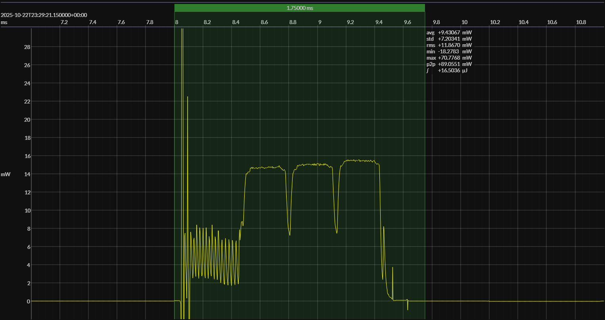
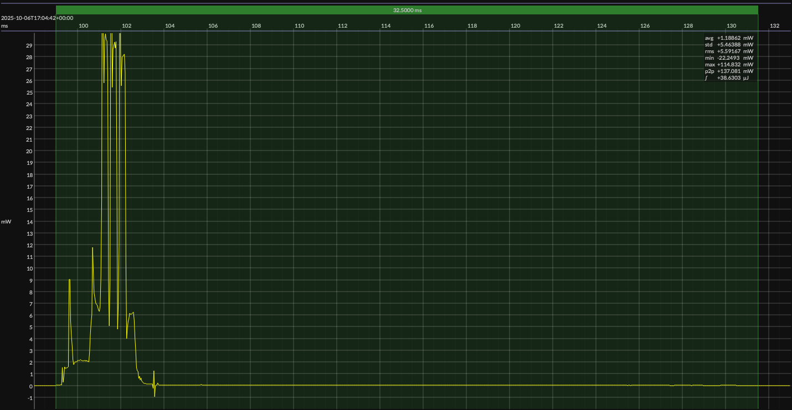

<h1 align="center">InPlay IN100 · &lt;no code&gt; · 3V3</h1>

## HW/SW configuration

## EM&bull;Scope results

<!-- @emscope-pack:start -->

captured on 2025-09-07 @ 20:58:13 generated on 2025-11-08 @ 17:07:01

## HW/SW Configuration

## EM&bull;Scope results · JS220

### 🟠&ensp;sleep

| supply voltage | &emsp;current (avg)&emsp; | &emsp;current (std)&emsp; | &emsp;average power&emsp;
|:---:|:---:|:---:|:---:|
| 3.3 V |  0.6 µA |  0.1 µA |  2.1 µW |

### 🟠&ensp;1&thinsp;s event period

| &emsp;&emsp;event energy (avg)&emsp;&emsp; | &emsp;&emsp;energy per period&emsp;&emsp; | &emsp;&emsp;energy per day&emsp;&emsp; | &emsp;&emsp;&emsp;**EM&bull;eralds**&emsp;&emsp;&emsp;
|:---:|:---:|:---:|:---:|
| 38.4 µJ | 40.5 µJ |  3.5 J | 22.85 |

### 🟠&ensp;10&thinsp;s event period

| &emsp;&emsp;event energy (avg)&emsp;&emsp; | &emsp;&emsp;energy per period&emsp;&emsp; | &emsp;&emsp;energy per day&emsp;&emsp; | &emsp;&emsp;&emsp;**EM&bull;eralds**&emsp;&emsp;&emsp;
|:---:|:---:|:---:|:---:|
| 38.4 µJ | 59.7 µJ |  0.5 J | 155.14 |

## Typical Event

## Notes

<!-- @emscope-pack:end -->

## Typical event

    

## Observations

