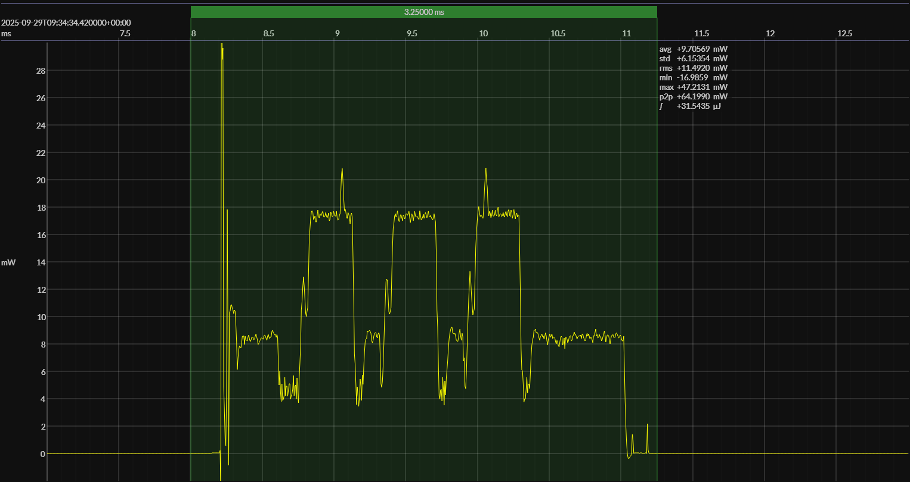

<h1 align="center">Texas Instruments CC2340R5 · SimpleLink SDK</h1>

## HW/SW configuration

* [CC2340R5 MCU](https://www.ti.com/product/CC2340R5) &ndash; 48&thinsp;MHz Cortex-M0+ &thinsp;|&thinsp; &le;&thinsp;512&thinsp;KB flash &thinsp;|&thinsp; &le;&thinsp;64&thinsp;KB SRAM
* [LP-EM-CC2340R5 dev kit](https://www.ti.com/tool/LP-EM-CC2340R5)
* [Code Composer Studio IDE](https://www.ti.com/tool/CCSTUDIO) &ndash; version 12.4.0
* [TI Arm Clang compiler](https://www.ti.com/tool/download/ARM-CGT-CLANG) &ndash; version 2.1.3
* [SimpleLink SDK](https://www.ti.com/tool/SIMPLELINK-LOWPOWER-SDK) &ndash; version 8.10.0

## EM&bull;Scope results

<!-- @emscope-pack:start -->

### 🟠&ensp;sleep

| supply voltage | &emsp;current (avg)&emsp; | &emsp;current (std)&emsp; | &emsp;average power&emsp;
|:---:|:---:|:---:|:---:|
| 3.29 V | 589.092 nA |  14.548 µA |   1.941 µW |

### 🟠&ensp;1&thinsp;s event period

| &emsp;&emsp;event energy (avg)&emsp;&emsp; | &emsp;&emsp;energy per period&emsp;&emsp; | &emsp;&emsp;energy per day&emsp;&emsp; | &emsp;&emsp;&emsp;**EM&bull;eralds**&emsp;&emsp;&emsp;
|:---:|:---:|:---:|:---:|
|  30.980 µJ |  32.921 µJ |   2.844 J | 28.13 |

### 🟠&ensp;10&thinsp;s event period

| &emsp;&emsp;event energy (avg)&emsp;&emsp; | &emsp;&emsp;energy per period&emsp;&emsp; | &emsp;&emsp;energy per day&emsp;&emsp; | &emsp;&emsp;&emsp;**EM&bull;eralds**&emsp;&emsp;&emsp;
|:---:|:---:|:---:|:---:|
|  30.980 µJ |  50.388 µJ | 435.354 mJ | 183.76 |

 

generated at 2025-10-06T15:20:47.522Z

    

<!-- @emscope-pack:end -->

## Typical event

    

## Observations

* results align with the vendor's power specifications
* highly competitive deep-sleep current (~600&thinsp;nA)
* excessive CPU activity (~750&thinsp;&mu;S) lowers final score
