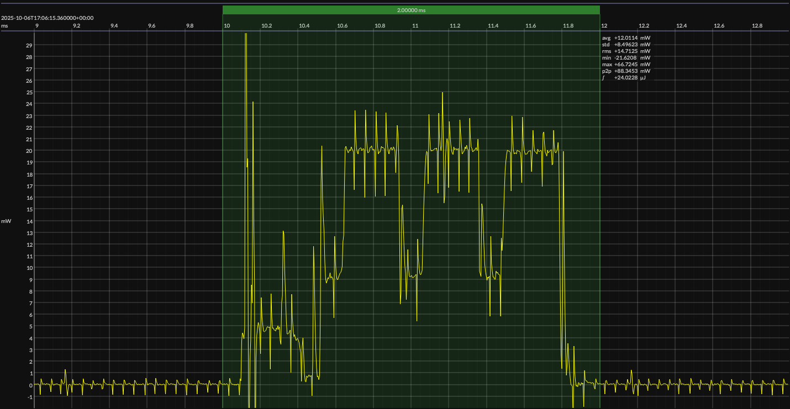

<h1 align="center">Nordic nRF52832 · EM&bull;Script SDK · 3V3</h1>

<!-- @emscope-pack:start -->

## HW/SW Configuration

* [nRF52-DK](https://www.nordicsemi.com/Products/Development-hardware/nRF52-DK) &thinsp;&ratio;&thinsp; **Nordic nRF52 Development Kit**
* [nRF52832 SoC](https://www.nordicsemi.com/Products/nRF52832) &thinsp;&ratio;&thinsp; 
64 MHz ARM Cortex-M4 &thinsp;·&thinsp; 512 KB flash &thinsp;·&thinsp; 64 KB SRAM

* [BOARD PINOUT](https://github.com/em-foundation/emscope/blob/docs-stable/docs/boards/nrf-52-dk.png) &thinsp;⚙️
* [EM•Script SDK](https://docs.emscript.openem.org/) &ndash; version 26.2.0
* [BUILD ARTIFACTS](../emscript) &thinsp;⚙️

## EM&bull;Scope results · JS220

### 🟠&ensp;sleep

| supply voltage | &emsp;current (avg)&emsp; | &emsp;current (std)&emsp; | &emsp;average power&emsp;
|:---:|:---:|:---:|:---:|
| 3.3 V |  2.5 µA | 14.0 µA |  8.1 µW |

### 🟠&ensp;1&thinsp;s event period

| &emsp;&emsp;event energy (avg)&emsp;&emsp; | &emsp;&emsp;energy per period&emsp;&emsp; | &emsp;&emsp;energy per day&emsp;&emsp; | &emsp;&emsp;&emsp;**EM&bull;eralds**&emsp;&emsp;&emsp;
|:---:|:---:|:---:|:---:|
| 24.3 µJ | 32.4 µJ |  2.8 J | 28.57 |

### 🟠&ensp;10&thinsp;s event period

| &emsp;&emsp;event energy (avg)&emsp;&emsp; | &emsp;&emsp;energy per period&emsp;&emsp; | &emsp;&emsp;energy per day&emsp;&emsp; | &emsp;&emsp;&emsp;**EM&bull;eralds**&emsp;&emsp;&emsp;
|:---:|:---:|:---:|:---:|
| 24.3 µJ | 105.2 µJ |  0.9 J | 88.03 |

 

generated at 2025-11-07T19:09:17.728Z

## Typical Event

## Notes

<!-- @emscope-pack:end -->
