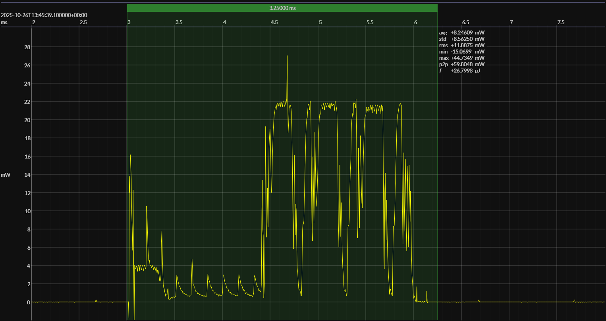

<h1 align="center">Nordic nRF52832 · Zephyr OS · 2V7</h1>

<!-- @emscope-pack:start -->

<!-- *** AUTOMATICALLY GENERATED CONTENT – DO NOT EDIT *** -->  

captured on 2025-10-26 @ 13:44:26 generated on 2025-11-09 @ 13:59:34

## HW/SW Configuration

* [nRF52-DK](https://www.nordicsemi.com/Products/Development-hardware/nRF52-DK) &thinsp;&ratio;&thinsp; **Nordic nRF52 Development Kit**
* [nRF52832 SoC](https://www.nordicsemi.com/Products/nRF52832) &thinsp;&ratio;&thinsp; 
64 MHz ARM Cortex-M4 &thinsp;·&thinsp; 512 KB flash &thinsp;·&thinsp; 64 KB SRAM

* [BOARD PINOUT](https://github.com/em-foundation/emscope/blob/docs-stable/docs/boards/nrf-52-dk.png) &thinsp;⚙️

* [nRF Connect SDK](https://www.nordicsemi.com/Products/Development-software/nRF-Connect-SDK) &ndash; version 3.0.2
* [nRF Connect SDK Toolchain](https://www.nordicsemi.com/Products/Development-software/nRF-Connect-SDK) &ndash; version 3.0.2

* [BUILD ARTIFACTS](../zephyr) &thinsp;⚙️

## EM&bull;Scope results · JS220

### 🟠&ensp;sleep

| supply voltage | &emsp;current (avg)&emsp; | &emsp;current (std)&emsp; | &emsp;average power&emsp;
|:---:|:---:|:---:|:---:|
| 2.7 V |  1.3 µA |  8.6 µA |  3.5 µW |

### 🟠&ensp;1&thinsp;s event period

| &emsp;&emsp;event energy (avg)&emsp;&emsp; | &emsp;&emsp;energy per period&emsp;&emsp; | &emsp;&emsp;energy per day&emsp;&emsp; | &emsp;&emsp;&emsp;**EM&bull;eralds**&emsp;&emsp;&emsp;
|:---:|:---:|:---:|:---:|
| 27.0 µJ | 30.5 µJ |  2.6 J | 30.39 |

### 🟠&ensp;10&thinsp;s event period

| &emsp;&emsp;event energy (avg)&emsp;&emsp; | &emsp;&emsp;energy per period&emsp;&emsp; | &emsp;&emsp;energy per day&emsp;&emsp; | &emsp;&emsp;&emsp;**EM&bull;eralds**&emsp;&emsp;&emsp;
|:---:|:---:|:---:|:---:|
| 27.0 µJ | 62.2 µJ |  0.5 J | 148.96 |

## Typical Event

## Notes

<!-- @emscope-pack:end -->
