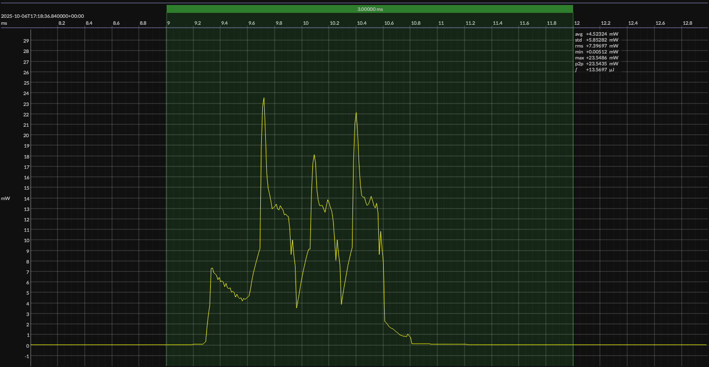

<h1 align="center">Nordic nRF54L15 · EM&bull;Script SDK · 1V8</h1>

<!-- @emscope-pack:start -->

<!-- *** AUTOMATICALLY GENERATED CONTENT – DO NOT EDIT *** -->  

captured on 2025-09-09 @ 02:31:44 generated on 2025-11-09 @ 13:59:35

## HW/SW Configuration

* [nRF54L15-DK](https://www.nordicsemi.com/Products/Development-hardware/nRF54L15-DK) &thinsp;&ratio;&thinsp; **Nordic nRF54L15 Development Kit**
* [nRF54L15 SoC](https://www.nordicsemi.com/Products/nRF52832) &thinsp;&ratio;&thinsp; 128 MHz ARM Cortex-M33 &thinsp;·&thinsp; 1.5 MB flash &thinsp;·&thinsp; 256 KB SRAM 

* [BOARD PINOUT](https://github.com/em-foundation/emscope/blob/docs-stable/docs/boards/nrf-54-dk.png) &thinsp;⚙️

* [EM•Script SDK](https://docs.emscript.openem.org/) &ndash; version 26.2.0
* [BUILD ARTIFACTS](../emscript) &thinsp;⚙️

## EM&bull;Scope results · PPK2

### 🟠&ensp;sleep

| supply voltage | &emsp;current (avg)&emsp; | &emsp;current (std)&emsp; | &emsp;average power&emsp;
|:---:|:---:|:---:|:---:|
| 1.8 V |  3.6 µA |  1.1 µA |  6.5 µW |

### 🟠&ensp;1&thinsp;s event period

| &emsp;&emsp;event energy (avg)&emsp;&emsp; | &emsp;&emsp;energy per period&emsp;&emsp; | &emsp;&emsp;energy per day&emsp;&emsp; | &emsp;&emsp;&emsp;**EM&bull;eralds**&emsp;&emsp;&emsp;
|:---:|:---:|:---:|:---:|
| 13.6 µJ | 20.1 µJ |  1.7 J | 46.07 |

### 🟠&ensp;10&thinsp;s event period

| &emsp;&emsp;event energy (avg)&emsp;&emsp; | &emsp;&emsp;energy per period&emsp;&emsp; | &emsp;&emsp;energy per day&emsp;&emsp; | &emsp;&emsp;&emsp;**EM&bull;eralds**&emsp;&emsp;&emsp;
|:---:|:---:|:---:|:---:|
| 13.6 µJ | 78.5 µJ |  0.7 J | 117.95 |

## Typical Event

## Notes

<!-- @emscope-pack:end -->
