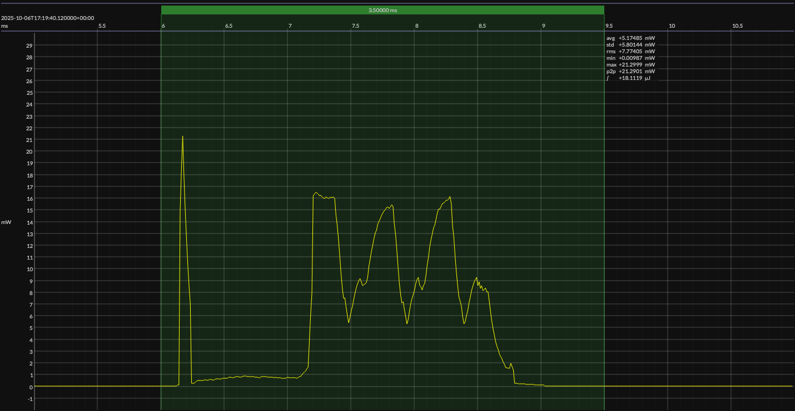

<h1 align="center">Nordic nRF54L15 · Zephyr OS · 3V3</h1>

<!-- @emscope-pack:start -->

## HW/SW Configuration

* [nRF54L15-DK](https://www.nordicsemi.com/Products/Development-hardware/nRF54L15-DK) &thinsp;&ratio;&thinsp; **Nordic nRF54L15 Development Kit**
* [nRF54L15 SoC](https://www.nordicsemi.com/Products/nRF52832) &thinsp;&ratio;&thinsp; 128 MHz ARM Cortex-M33 &thinsp;·&thinsp; 1.5 MB flash &thinsp;·&thinsp; 256 KB SRAM 

* [BOARD PINOUT](https://github.com/em-foundation/emscope/blob/docs-stable/docs/boards/nrf-54-dk.png) &thinsp;⚙️
* [nRF Connect SDK](https://www.nordicsemi.com/Products/Development-software/nRF-Connect-SDK) &ndash; version 3.0.2
* [nRF Connect SDK Toolchain](https://www.nordicsemi.com/Products/Development-software/nRF-Connect-SDK) &ndash; version 3.0.2

* [BUILD ARTIFACTS](../zephyr) &thinsp;⚙️

## EM&bull;Scope results · PPK2

### 🟠&ensp;sleep

| supply voltage | &emsp;current (avg)&emsp; | &emsp;current (std)&emsp; | &emsp;average power&emsp;
|:---:|:---:|:---:|:---:|
| 3.3 V |  3.4 µA |  0.7 µA | 11.2 µW |

### 🟠&ensp;1&thinsp;s event period

| &emsp;&emsp;event energy (avg)&emsp;&emsp; | &emsp;&emsp;energy per period&emsp;&emsp; | &emsp;&emsp;energy per day&emsp;&emsp; | &emsp;&emsp;&emsp;**EM&bull;eralds**&emsp;&emsp;&emsp;
|:---:|:---:|:---:|:---:|
| 17.8 µJ | 29.0 µJ |  2.5 J | 31.94 |

### 🟠&ensp;10&thinsp;s event period

| &emsp;&emsp;event energy (avg)&emsp;&emsp; | &emsp;&emsp;energy per period&emsp;&emsp; | &emsp;&emsp;energy per day&emsp;&emsp; | &emsp;&emsp;&emsp;**EM&bull;eralds**&emsp;&emsp;&emsp;
|:---:|:---:|:---:|:---:|
| 17.8 µJ | 129.9 µJ |  1.1 J | 71.26 |

 

generated at 2025-11-07T18:41:06.864Z

## Typical Event

## Notes

<!-- @emscope-pack:end -->
