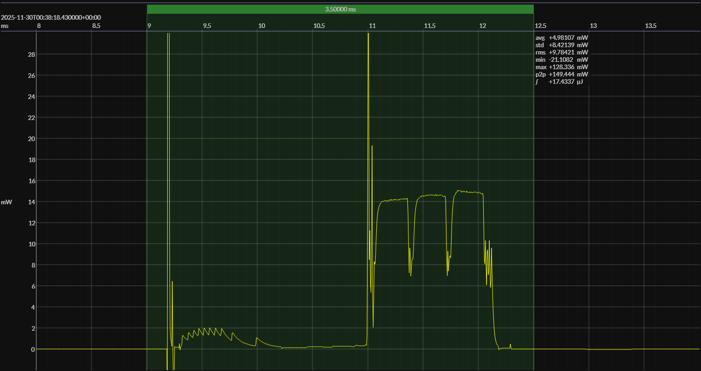

<h1 align="center">Nordic nRF54L15 · Zephyr OS · 3V0</h1>

<!-- @emscope-pack:start -->

<!-- *** AUTOMATICALLY GENERATED CONTENT – DO NOT EDIT *** -->  

captured on 2025-11-30 @ 00:36:13 generated on 2025-11-30 @ 00:39:51

## HW/SW Configuration

* [nRF54L15-DK](https://www.nordicsemi.com/Products/Development-hardware/nRF54L15-DK) &thinsp;&ratio;&thinsp; **Nordic nRF54L15 Development Kit**
* [nRF54L15 SoC](https://www.nordicsemi.com/Products/nRF52832) &thinsp;&ratio;&thinsp; 128 MHz ARM Cortex-M33 &thinsp;·&thinsp; 1.5 MB flash &thinsp;·&thinsp; 256 KB SRAM 

* [BOARD PINOUT](https://github.com/em-foundation/emscope/blob/docs-stable/docs/boards/nrf-54-dk.png) &thinsp;⚙️

* [nRF Connect SDK](https://www.nordicsemi.com/Products/Development-software/nRF-Connect-SDK) &ndash; version 3.1.1
* [nRF Connect SDK Toolchain](https://www.nordicsemi.com/Products/Development-software/nRF-Connect-SDK) &ndash; version 3.1.1

* [BUILD ARTIFACTS](../zephyr2) &thinsp;⚙️

## EM&bull;Scope results · JS220

### 🟠&ensp;sleep

| supply voltage | &emsp;current (avg)&emsp; | &emsp;current (std)&emsp; | &emsp;average power&emsp;
|:---:|:---:|:---:|:---:|
| 3.0 V |  1.9 µA |  0.8 µA |  5.6 µW |

### 🟠&ensp;1&thinsp;s event period

| &emsp;&emsp;event energy (avg)&emsp;&emsp; | &emsp;&emsp;energy per period&emsp;&emsp; | &emsp;&emsp;energy per day&emsp;&emsp; | &emsp;&emsp;&emsp;**EM&bull;eralds**&emsp;&emsp;&emsp;
|:---:|:---:|:---:|:---:|
| 17.9 µJ | 23.5 µJ |  2.0 J | 39.42 |

### 🟠&ensp;10&thinsp;s event period

| &emsp;&emsp;event energy (avg)&emsp;&emsp; | &emsp;&emsp;energy per period&emsp;&emsp; | &emsp;&emsp;energy per day&emsp;&emsp; | &emsp;&emsp;&emsp;**EM&bull;eralds**&emsp;&emsp;&emsp;
|:---:|:---:|:---:|:---:|
| 17.9 µJ | 74.2 µJ |  0.6 J | 124.80 |

## Typical Event

## Notes

<!-- @emscope-pack:end -->
