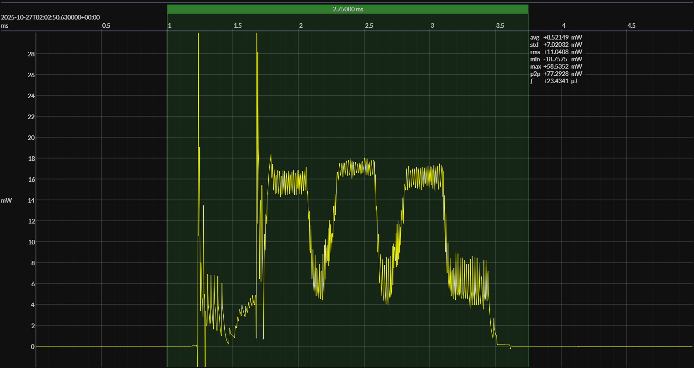

<h1 align="center">SiLabs EFR32xG22E · Simplicity (RAIL) · 3V0</h1>

<!-- @emscope-pack:start -->

captured on 2025-10-27 @ 02:01:19 generated on 2025-11-08 @ 17:07:07

## HW/SW Configuration

* [xG22-EK8200A](https://www.silabs.com/development-tools/wireless/efr32xg22e-energy-harvesting-explorer-kit?tab=overview) &thinsp;&ratio;&thinsp; **Silicon Labs ERF32xSG22E Energy Harvesting Explorer Kit**
* [EFR32xG22E SoC](https://www.silabs.com/wireless/bluetooth/efr32bg22-series-2-socs) &thinsp;&ratio;&thinsp; 76.8 MHz ARM Cortex-M33 &thinsp;·&thinsp; 512 KB flash &thinsp;·&thinsp; 32 KB SRAM

* [BOARD PINOUT](https://github.com/em-foundation/emscope/blob/docs-stable/docs/boards/sil-g22e-ehk.png) &thinsp;⚙️

* [Simplicity Studio](https://www.silabs.com/software-and-tools/simplicity-studio/simplicity-studio-version-5) &ndash; version 5

* [BUILD ARTIFACTS](../rail) &thinsp;⚙️

## EM&bull;Scope results · JS220

### 🟠&ensp;sleep

| supply voltage | &emsp;current (avg)&emsp; | &emsp;current (std)&emsp; | &emsp;average power&emsp;
|:---:|:---:|:---:|:---:|
| 3.0 V |  1.7 µA |  0.9 µA |  4.9 µW |

### 🟠&ensp;1&thinsp;s event period

| &emsp;&emsp;event energy (avg)&emsp;&emsp; | &emsp;&emsp;energy per period&emsp;&emsp; | &emsp;&emsp;energy per day&emsp;&emsp; | &emsp;&emsp;&emsp;**EM&bull;eralds**&emsp;&emsp;&emsp;
|:---:|:---:|:---:|:---:|
| 23.1 µJ | 28.0 µJ |  2.4 J | 33.02 |

### 🟠&ensp;10&thinsp;s event period

| &emsp;&emsp;event energy (avg)&emsp;&emsp; | &emsp;&emsp;energy per period&emsp;&emsp; | &emsp;&emsp;energy per day&emsp;&emsp; | &emsp;&emsp;&emsp;**EM&bull;eralds**&emsp;&emsp;&emsp;
|:---:|:---:|:---:|:---:|
| 23.1 µJ | 72.4 µJ |  0.6 J | 127.88 |

## Typical Event

## Notes

<!-- @emscope-pack:end -->
