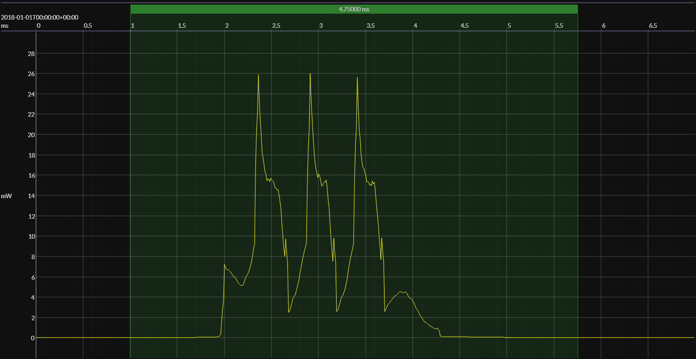

<h1 align="center">SiLabs EFR32xG22E · Simplicity (RAIL)</h1>

## HW/SW configuration

## EM&bull;Scope results

<!-- @emscope-pack:start -->

### 🟠&ensp;sleep

| supply voltage | &emsp;current (avg)&emsp; | &emsp;current (std)&emsp; | &emsp;average power&emsp;
|:---:|:---:|:---:|:---:|
| 1.80 V |   4.368 µA | 628.911 nA |   7.863 µW |

### 🟠&ensp;1&thinsp;s event cycle

| &emsp;&emsp;event energy (avg)&emsp;&emsp; | &emsp;&emsp;energy per cycle&emsp;&emsp; | &emsp;&emsp;energy per day&emsp;&emsp; | &emsp;&emsp;&emsp;**EM&bull;eralds**&emsp;&emsp;&emsp;
|:---:|:---:|:---:|:---:|
|  21.147 µJ |  29.011 µJ |   2.507 J | 31.92 |

### 🟠&ensp;10&thinsp;s event cycle

| &emsp;&emsp;event energy (avg)&emsp;&emsp; | &emsp;&emsp;energy per cycle&emsp;&emsp; | &emsp;&emsp;energy per day&emsp;&emsp; | &emsp;&emsp;&emsp;**EM&bull;eralds**&emsp;&emsp;&emsp;
|:---:|:---:|:---:|:---:|
|  21.147 µJ |  99.780 µJ | 862.102 mJ | 92.80 |

 

generated at 2025-08-31T14:28:24.291Z

    

<!-- @emscope-pack:end -->

## Typical event

    

## Observations

