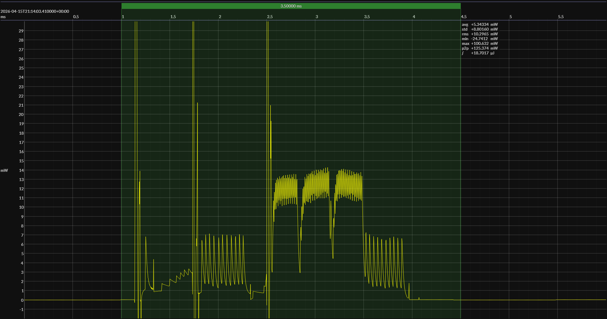

<h1 align="center">STMicro WBA2 · CUBE · 1V8</h1>

<!-- @emscope-pack:start -->

<!-- *** AUTOMATICALLY GENERATED CONTENT – DO NOT EDIT *** -->  

captured on 2026-04-15 @ 21:13:18 generated on 2026-04-15 @ 21:14:17

## HW/SW Configuration

* [NUCLEO-WBA25CE1](https://www.st.com/en/evaluation-tools/nucleo-wba25ce1.html) &thinsp;&ratio;&thinsp; **STM32WBA25 Nucleo-64 Development Board**
* [STM32WBA25CEU7 SoC](https://www.st.com/en/microcontrollers-microprocessors/stm32wba25ce.html) &thinsp;&ratio;&thinsp; 64 MHz ARM Cortex-M33 &thinsp;·&thinsp; 512 KB flash &thinsp;·&thinsp; 96 KB SRAM

* [BOARD PINOUT](https://www.st.com/en/evaluation-tools/nucleo-wba25ce1.html#cad-resources) &thinsp;⚙️

* [STM32CubeWBA](https://www.st.com/en/embedded-software/stm32cubewba.html) &ndash; version 1.9.0

* [BUILD ARTIFACTS]() &thinsp;⚙️

## EM&bull;Scope results · JS220

### 🟠&ensp;sleep

| supply voltage | &emsp;current (avg)&emsp; | &emsp;current (std)&emsp; | &emsp;average power&emsp;
|:---:|:---:|:---:|:---:|
| 1.8 V |  0.9 µA |  0.6 µA |  1.6 µW |

### 🟠&ensp;1&thinsp;s event period

| &emsp;&emsp;event energy (avg)&emsp;&emsp; | &emsp;&emsp;energy per period&emsp;&emsp; | &emsp;&emsp;energy per day&emsp;&emsp; | &emsp;&emsp;&emsp;**EM&bull;eralds**&emsp;&emsp;&emsp;
|:---:|:---:|:---:|:---:|
| 19.0 µJ | 20.6 µJ |  1.8 J | 44.97 |

### 🟠&ensp;10&thinsp;s event period

| &emsp;&emsp;event energy (avg)&emsp;&emsp; | &emsp;&emsp;energy per period&emsp;&emsp; | &emsp;&emsp;energy per day&emsp;&emsp; | &emsp;&emsp;&emsp;**EM&bull;eralds**&emsp;&emsp;&emsp;
|:---:|:---:|:---:|:---:|
| 19.0 µJ | 35.3 µJ |  0.3 J | 262.64 |

## Typical Event

## Notes

<!-- @emscope-pack:end -->
