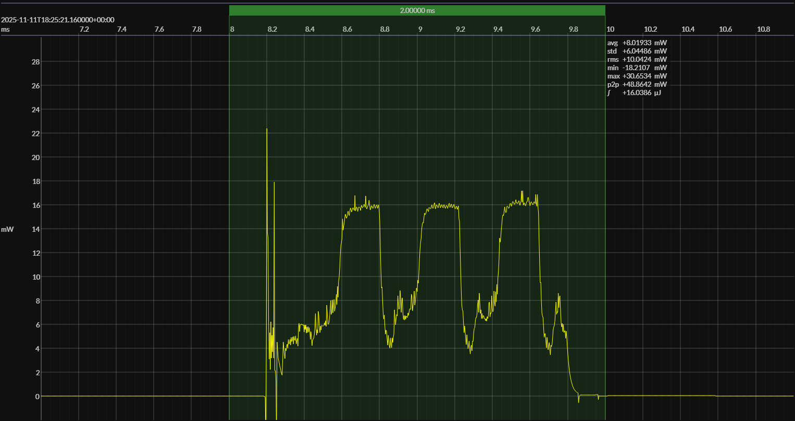

<h1 align="center">Texas Instruments CC2340R5 · EM&bull;Script SDK · 2V2</h1>

<!-- @emscope-pack:start -->

captured on 2025-10-31 @ 01:16:47 generated on 2025-11-08 @ 17:07:08

## HW/SW Configuration

* [LP-EM-CC2340R5 dev kit](https://www.ti.com/tool/LP-EM-CC2340R5) &thinsp;&ratio;&thinsp; **Texas Instruments CC2340R5 LaunchPad**
* [CC2340R5 SoC](https://www.ti.com/product/CC2340R5) &thinsp;&ratio;&thinsp; 48&thinsp;MHz Cortex-M0+ &thinsp;·&thinsp; 512&thinsp;KB flash &thinsp;·&thinsp; 64&thinsp;KB SRAM

* [BOARD PINOUT](https://github.com/em-foundation/emscope/blob/docs-stable/docs/boards/ti-23-lp.png) &thinsp;⚙️

* [EM•Script SDK](https://docs.emscript.openem.org/) &ndash; version 26.2.0

* [BUILD ARTIFACTS](../emscript) &thinsp;⚙️

## EM&bull;Scope results · JS220

### 🟠&ensp;sleep

| supply voltage | &emsp;current (avg)&emsp; | &emsp;current (std)&emsp; | &emsp;average power&emsp;
|:---:|:---:|:---:|:---:|
| 2.2 V |  0.6 µA |  5.2 µA |  1.3 µW |

### 🟠&ensp;1&thinsp;s event period

| &emsp;&emsp;event energy (avg)&emsp;&emsp; | &emsp;&emsp;energy per period&emsp;&emsp; | &emsp;&emsp;energy per day&emsp;&emsp; | &emsp;&emsp;&emsp;**EM&bull;eralds**&emsp;&emsp;&emsp;
|:---:|:---:|:---:|:---:|
| 20.2 µJ | 21.5 µJ |  1.9 J | 43.12 |

### 🟠&ensp;10&thinsp;s event period

| &emsp;&emsp;event energy (avg)&emsp;&emsp; | &emsp;&emsp;energy per period&emsp;&emsp; | &emsp;&emsp;energy per day&emsp;&emsp; | &emsp;&emsp;&emsp;**EM&bull;eralds**&emsp;&emsp;&emsp;
|:---:|:---:|:---:|:---:|
| 20.2 µJ | 33.0 µJ |  0.3 J | 280.50 |

## Typical Event

## Notes

<!-- @emscope-pack:end -->
