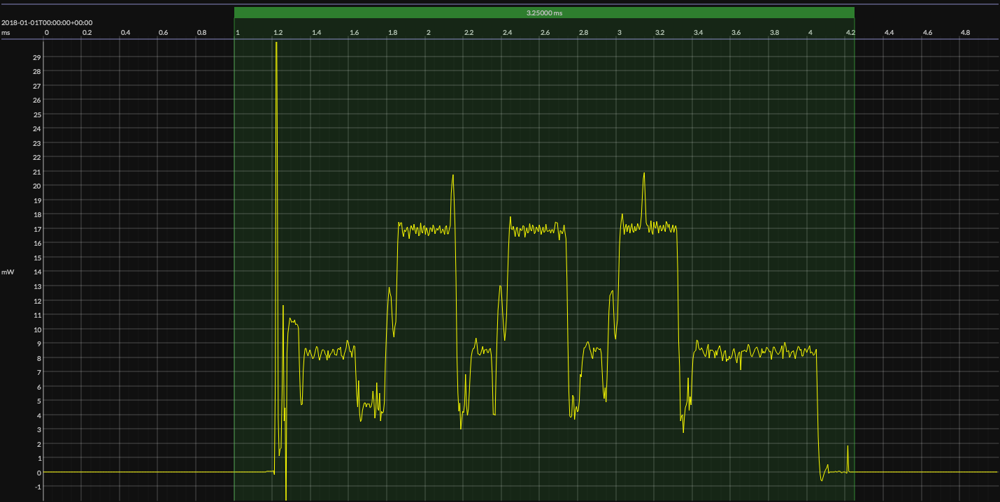

# Texas Instruments CC2340R5 · SimpleLink SDK

## HW/SW Configuration

* [CC2340R5 MCU](https://www.ti.com/product/CC2340R5) &ndash; 48&thinsp;MHz Cortex-M0+ &thinsp;|&thinsp; &le;&thinsp;512&thinsp;KB flash &thinsp;|&thinsp; &le;&thinsp;64&thinsp;KB SRAM
* [LP-EM-CC2340R5 dev kit](https://www.ti.com/tool/LP-EM-CC2340R5)
* [Code Composer Studio IDE](https://www.ti.com/tool/CCSTUDIO) &ndash; version 12.4.0
* [TI Arm Clang compiler](https://www.ti.com/tool/download/ARM-CGT-CLANG) &ndash; version 2.1.3
* [SimpleLink SDK](https://www.ti.com/tool/SIMPLELINK-LOWPOWER-SDK) &ndash; version 8.10.0

## Typical event

    

<!-- *** do not edit below this line *** -->

## EM&bull;Scope results

### 🟠&ensp;sleep

| supply voltage | &emsp;current (avg)&emsp; | &emsp;current (std)&emsp; | &emsp;average power&emsp;
|:---:|:---:|:---:|:---:|
| 3.29&thinsp;V| 589.092&thinsp;nA | 14.548&thinsp;&mu;A | 1.941&thinsp;&mu;W |

### 🟠&ensp;1&thinsp;s event cycle

| &emsp;&emsp;event energy (avg)&emsp;&emsp; | &emsp;&emsp;energy per cycle&emsp;&emsp; | &emsp;&emsp;energy per day&emsp;&emsp; | &emsp;&emsp;&emsp;**EM&bull;eralds**&emsp;&emsp;&emsp;
|:---:|:---:|:---:|:---:|
| 30.980&thinsp;&mu;J | 32.971&thinsp;&mu;J | 2.844&thinsp;J | 28.13 |

### 🟠&ensp;10&thinsp;s event cycle

| &emsp;&emsp;event energy (avg)&emsp;&emsp; | &emsp;&emsp;energy per cycle&emsp;&emsp; | &emsp;&emsp;energy per day&emsp;&emsp; | &emsp;&emsp;&emsp;**EM&bull;eralds**&emsp;&emsp;&emsp;
|:---:|:---:|:---:|:---:|
| 30.980&thinsp;&mu;J | 50.388&thinsp;&mu;J | 435.354&thinsp;mJ | 183.76 |

generated at 2025-08-28T14:15:00.905Z

